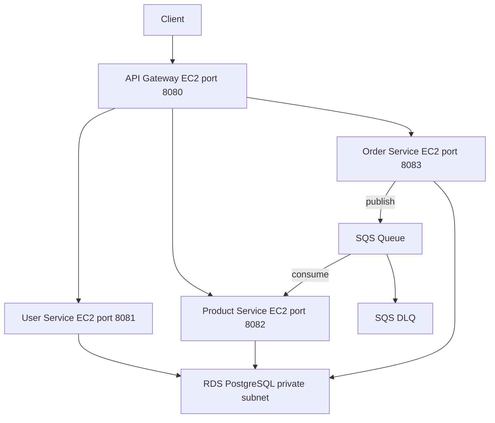

# Architecture

## Overview

Cloud-native microservices application deployed on AWS using Docker, Terraform, Ansible, and GitHub Actions.

## Architecture Diagram

## Services

| Service | Port | Responsibility |
|---|---|---|
| api-gateway | 8080 | Single entry point, routing |
| user-service | 8081 | User management |
| product-service | 8082 | Product catalog and inventory |
| order-service | 8083 | Order management |

## Inter-Service Communication

- **Synchronous**: OpenFeign HTTP calls (order-service to user-service and product-service)
- **Asynchronous**: SQS (order-service publishes, product-service consumes)

## Infrastructure

- 4 EC2 instances t3.micro, one per service
- 1 RDS PostgreSQL db.t3.micro in private subnet
- 1 SQS queue plus DLQ
- Custom VPC with public and private subnets
- Remote Terraform state in S3 with DynamoDB locking
