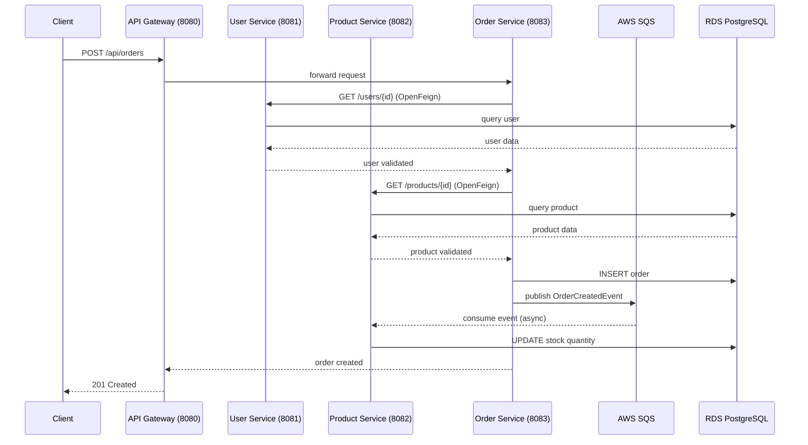
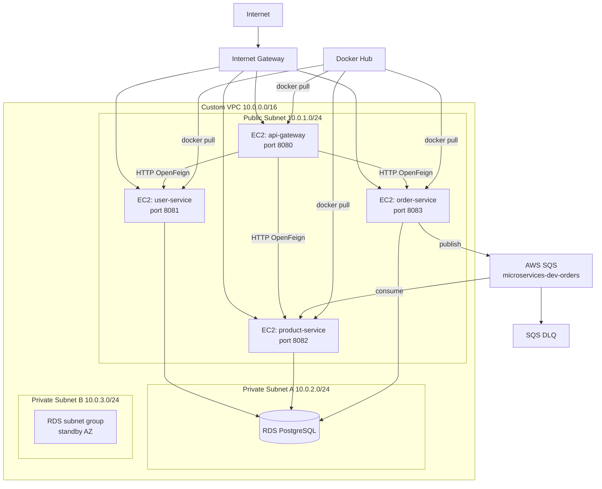

# Architecture

## Overview

This project implements a cloud-native microservices application deployed on AWS. Four Spring Boot services run on separate EC2 instances, communicate synchronously via OpenFeign and asynchronously via AWS SQS, and persist data to a shared RDS PostgreSQL database.

## Application Flow

## Infrastructure Layout

## Components

| Component | Type | Subnet | Purpose |
|---|---|---|---|
| api-gateway | EC2 + Docker | Public | Single entry point, routes requests to services |
| user-service | EC2 + Docker | Public | User CRUD operations |
| product-service | EC2 + Docker | Public | Product catalog and inventory management |
| order-service | EC2 + Docker | Public | Order management, SQS producer |
| SQS Queue | Managed | — | Async buffer between order and product service |
| Dead Letter Queue | Managed | — | Captures messages that fail 3 times |
| RDS PostgreSQL | Managed | Private | Persistent storage for all services |
| Docker Hub | External | — | Container image registry |

## Inter-Service Communication

### Synchronous (OpenFeign)
Order Service calls User Service and Product Service via HTTP before creating an order:
- Validates user exists
- Validates products exist and have sufficient stock

### Asynchronous (SQS)
After creating an order, Order Service publishes an OrderCreatedEvent to SQS. Product Service consumes this event and updates inventory.

## Design Decisions

**Why one EC2 per service?**
Each service runs on its own EC2 instance to ensure resource isolation. A t3.micro has 1GB RAM which is sufficient for a single Spring Boot service. Running multiple services on one instance caused memory exhaustion during testing.

**Why RDS in private subnets?**
The database should never be accessible from the internet. Only the application EC2 instances can reach it via the security group rule scoped to the app security group ID.

**Why SQS instead of Kafka?**
The course requires SQS. Additionally, SQS is fully managed — no broker to provision or maintain. The DLQ provides automatic retry handling for failed messages.

**Why OIDC instead of access keys for GitHub Actions?**
Access keys are long-lived credentials that could be leaked. OIDC tokens are ephemeral and scoped to a specific repository. This follows AWS best practices and the principle of least privilege.

**Why Ansible for deployment?**
Ansible provides idempotent configuration management. The same playbook can be run multiple times safely. It also provides a clear audit trail of what is deployed and how.
